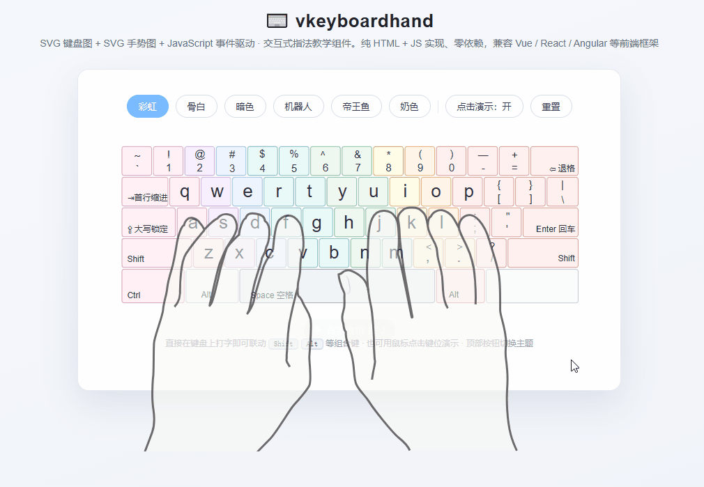

# ⌨️ kids-keywords · Kids English Vocabulary Typing & Dictation

An English vocabulary & sentence learning app for kids (Shanghai primary school grades 1–3): **read English and type it, read Chinese and spell it** — with real-time touch-typing fingering guidance. Fully offline, no login, no backend.

<p align="center">
  
</p>

[English](README.md) | [简体中文](README_zh.md)

## Features

- 📖 **Typing Practice** — read English, type English, checked character by character: correct characters turn green and advance, wrong ones flash red and block progress; auto-jumps to the next item when complete, building ten-finger technique and spelling fluency
- ✍️ **Dictation Practice** — only the Chinese translation is shown; the English answer appears as same-length underscore placeholders (spaces and punctuation included), typed character by character; the timer starts on entry and stops on submit, each item scored
- 🖐 **Real-time Fingering Guidance** — powered by the open-source vkeyboardhand component: pressing a real key lights up the matching on-screen key and switches the hand-gesture diagram in sync, showing "which finger presses which key" in real time
- 📊 **Scores & History** — after submitting a dictation, wrong answers are shown aligned line by line (correct text vs. your input, differing characters highlighted in red) with a percentage score and elapsed time; the history page lists past scores newest-first and supports clearing
- 📂 **Vocabulary Maintenance** — batch import / export via Excel (download a template, upload to replace the whole bank); add, edit and remove items without touching any code
- 🎯 **Dynamic Filters** — filter questions by grade / unit / custom fields (e.g. part of speech, topic); filter widgets are generated automatically from the actual fields in your vocabulary
- 📱 **Offline PWA** — install to the home screen and use it like a native app (Android / iPad tablets), fully offline
- 💻 **Desktop Builds** — Windows installer & portable edition; macOS DMG built in the cloud via GitHub Actions
- 🔒 **Local-first Data** — vocabulary and scores stay in the browser (sql.js + IndexedDB): no accounts, no backend, no login

## Pages & Usage

| Page | Description |
| --- | --- |
| Home `index.html` | Pick grades (multi-select), learning mode (typing / dictation) and dictation challenge count (20 / 30 / 50); filter by unit and dynamic fields (part of speech, topic, etc.); entries to History and Data Maintenance |
| Practice `practice.html` | Two modes (typing / dictation); back button on top, virtual keyboard at the bottom with real-time fingering linkage; switch items via side buttons or arrow keys |
| Result (inside practice) | After a dictation is submitted: percentage score, elapsed time and character-by-character comparison of wrong answers |
| History `history.html` | Review past scores newest-first (username, mode, grades, count, score, duration, time); supports clearing all records |
| Data Maintenance `data.html` | Download the Excel template, export the current vocabulary, or import an Excel file to replace the whole bank (with stats & preview) |
| Help `help.html` | Demo and usage notes for the vkeyboardhand component |

## Tech Stack

- **vkeyboardhand** (MIT License): virtual keyboard + hand-gesture fingering component, reused on the practice page for key highlighting and finger hints
- **sql.js + IndexedDB**: SQLite running in the browser; vocabulary and scores persist locally across sessions
- **SheetJS (xlsx)**: Excel template download, vocabulary import / export
- **Service Worker**: PWA offline caching — works without network once installed
- **Electron**: Windows / macOS desktop shell (custom `app://` protocol serving the static site)

## Development

```bash
pnpm install      # install dependencies
pnpm build        # build vocabulary + sql.js runtime (generates data/vocabulary.sqlite and vendor/)
pnpm icons        # generate app icons from SVG sources
pnpm preview      # local preview at http://localhost:8011
pnpm app          # run as an Electron desktop app
pnpm app:win      # package for Windows (NSIS installer + portable)
pnpm app:mac      # package for macOS (run on a Mac)
```

> The local preview port is fixed at **8011**; this is a pure front-end project with no backend port.

## Cross-platform Installation

| Platform | Method |
| --- | --- |
| Windows | installer / portable exe under `release/` |
| macOS | DMG built on GitHub Actions mac runners |
| Android tablet | Chrome / Edge → visit the deployed site → "Add to Home screen" |
| iPad | Safari → visit the deployed site → Share → "Add to Home Screen" |

See [docs/INSTALL.md](./docs/INSTALL.md) for details.

## Directory Structure

```text
├── app/                      # app scripts & styles
│   ├── home.js / practice.js # home / practice page logic
│   ├── typing.js / dictation.js # typing / dictation practice engines
│   ├── db.js / store.js      # sql.js wrapper + IndexedDB persistence
│   ├── data-maintain.js / xlsx-io.js # data maintenance page + Excel import/export
│   └── pwa.js                # service worker registration (offline cache)
├── src/ + dist/              # vkeyboardhand fingering component source & build
├── svg/                      # keyboard / hand-gesture vector assets
├── electron/main.cjs         # Electron main process (app:// protocol)
├── scripts/                  # component build, vocabulary build, icon generation
├── docs/                     # PRD / SDD / INSTALL (cross-platform install guide)
├── icons/                    # PWA / iOS / Electron app icons
├── index.html / practice.html / help.html / history.html / data.html
├── manifest.webmanifest      # PWA manifest
├── sw.js                     # service worker offline cache
└── package.json
```

## Acknowledgements

- [vkeyboardhand](https://github.com/ayuday/vkeyboardhand) (MIT License): interactive virtual-keyboard touch-typing component, integrated on the practice page for keyboard & hand-gesture linkage
- [SVG keyboard image](https://commons.wikimedia.org/wiki/File:Keyboard_US.svg) (Wikimedia Commons, CC BY-SA 4.0)

## License

[MIT](./LICENSE)
