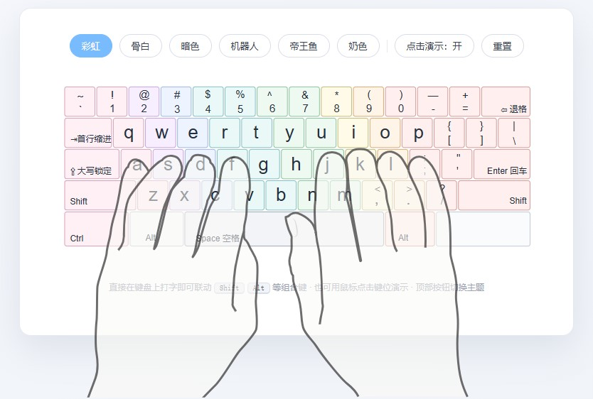

# ⌨️ kids-keywords · 小朋友入门英语打字背默学习

面向小朋友（沪教版上海小学 1–3 年级）的英语词汇与句型学习应用：看英文打字、看中文背默，实时指法联动。基于开源组件 [vkeyboardhand](https://github.com/ayuday/vkeyboardhand)（MIT License）二次开发。

<p align="center">
  
  
  
  
  
</p>

[English](README.md) | [简体中文](README_zh.md)

<p align="center">
  
</p>
<p align="center">
  
</p>


## 功能特性

- 🎹 SVG 键盘图 + 🖐 SVG 手势图联动：按下真实键盘（或点击键位）时，对应键位高亮、手势图同步切换、指法提示条实时显示“哪个手指按哪个键”。
- ⌨️ `KeyboardEvent` 事件驱动：监听 `keydown` / `keyup`，支持 `Shift` / `Alt` 等组合键手势联动。
- 🎨 彩虹配色（默认主题）：按键按手指区域着色，左冷右暖形成彩虹渐变（配色约定见 `colorful.md`）。
- 🧩 框架无关：组件内部只操作 DOM，不依赖任何框架，Vue / React / Angular 均可直接使用。
- 📦 三种引入方式：本地 `<script>`、CDN、npm + ESM。
- ⚙️ 完整 API：`press / release / play / reset / setTheme / setClickEnabled / getState / destroy` 及事件回调。
- 🗂 键位映射表（数据层）：`按键 → 手指 → SVG id` 三层映射，可通过配置覆盖。

## 技术栈

- **SVG（内联注入）**：键盘图 + 手指手势图
- **JavaScript DOM 操作**：控制 SVG 元素显隐、样式
- **KeyboardEvent API**：监听用户按键
- **CSS Transition / Animation**：按键按下动画、高亮过渡
- **键位映射表（数据）**：按键 → 手指 → SVG id 的对应关系
- **fetch / 内联**：加载 SVG 文件

## 安装

### 方法 1：纯 HTML + JS（本地引入 / CDN）

```html
<!-- 组件样式 -->
<link rel="stylesheet" href="dist/vkeyboardhand.css">
<!-- 组件脚本（UMD，挂载为 window.VKeyboardHand） -->
<script src="dist/vkeyboardhand.umd.js"></script>

<div id="demo"></div>

<script>
  var kb = VKeyboardHand.create('#demo', {
    keyboard: './svg/keyboard.svg', // 键盘 SVG（URL / 内联字符串 / SVGElement）
    hand: './svg/hand.svg'          // 手势 SVG
  });
</script>
```

发布到 npm 后可直接使用 CDN（jsDelivr / unpkg）：

```html
<link rel="stylesheet" href="https://cdn.jsdelivr.net/npm/vkeyboardhand@latest/dist/vkeyboardhand.css">
<script src="https://cdn.jsdelivr.net/npm/vkeyboardhand@latest/dist/vkeyboardhand.umd.js"></script>
<!-- 或 -->
<link rel="stylesheet" href="https://unpkg.com/vkeyboardhand@latest/dist/vkeyboardhand.css">
<script src="https://unpkg.com/vkeyboardhand@latest/dist/vkeyboardhand.umd.js"></script>
```

> 键盘图与手势图可从包内获取：`https://cdn.jsdelivr.net/npm/vkeyboardhand@latest/svg/keyboard.svg`、`.../svg/hand.svg`。

### 方法 2：npm 安装（Vue / React / Angular）

```bash
npm install vkeyboardhand
```

```js
// 引入样式（入口文件或组件中）
import 'vkeyboardhand/vkeyboardhand.css';
// 引入组件
import VKeyboardHand from 'vkeyboardhand';

const kb = VKeyboardHand.create(document.getElementById('demo'), {
  keyboard: '/assets/svg/keyboard.svg',
  hand: '/assets/svg/hand.svg'
});
```

> 说明：`keyboard` / `hand` 支持 **SVG 文件 URL、SVG 字符串、已存在的 SVGElement** 三种数据源。在打包工具中也可 `import kbSvg from 'vkeyboardhand/svg/keyboard.svg?raw'` 后直接传入字符串。

#### Vue 3

```vue
<template>
  <div ref="host"></div>
</template>

<script setup>
import { ref, onMounted, onBeforeUnmount } from 'vue';
import VKeyboardHand from 'vkeyboardhand';

const host = ref(null);
let kb = null;

onMounted(() => {
  kb = VKeyboardHand.create(host.value, {
    keyboard: '/assets/svg/keyboard.svg',
    hand: '/assets/svg/hand.svg'
  });
});

onBeforeUnmount(() => kb && kb.destroy());
</script>
```

#### React

```jsx
import { useEffect, useRef } from 'react';
import VKeyboardHand from 'vkeyboardhand';

export default function FingerTeaching() {
  const host = useRef(null);

  useEffect(() => {
    const kb = VKeyboardHand.create(host.current, {
      keyboard: '/assets/svg/keyboard.svg',
      hand: '/assets/svg/hand.svg'
    });
    return () => kb.destroy();
  }, []);

  return <div ref={host} />;
}
```

#### Angular

```ts
import { Component, ElementRef, ViewChild, AfterViewInit, OnDestroy } from '@angular/core';
import VKeyboardHand from 'vkeyboardhand';

@Component({
  selector: 'app-finger-teaching',
  template: `<div #host></div>`
})
export class FingerTeachingComponent implements AfterViewInit, OnDestroy {
  @ViewChild('host', { static: true }) host!: ElementRef<HTMLDivElement>;
  private kb: VKeyboardHand | null = null;

  ngAfterViewInit(): void {
    this.kb = VKeyboardHand.create(this.host.nativeElement, {
      keyboard: 'assets/svg/keyboard.svg',
      hand: 'assets/svg/hand.svg'
    });
  }

  ngOnDestroy(): void { this.kb?.destroy(); }
}
```

> 完整可运行示例见 [`examples/`](./examples)：`vue.html`、`react.html`、`esm.html`、`angular/app.component.ts`。

## API 文档

### 配置项（options）

| 参数 | 类型 | 默认值 | 说明 |
| --- | --- | --- | --- |
| `keyboard` | `string \| SVGElement` | `'./svg/keyboard.svg'` | 键盘 SVG：URL / 内联字符串 / 元素 |
| `hand` | `string \| SVGElement` | `'./svg/hand.svg'` | 手势 SVG：URL / 内联字符串 / 元素 |
| `theme` | `string` | `'colorful'` | 主题：`colorful`（默认彩虹）/ `bone` / `dark` / `robot` / `kingfish` / `milk` |
| `listenKeyboard` | `boolean` | `true` | 是否监听真实键盘 |
| `enableClick` | `boolean` | `true` | 是否允许点击键位演示 |
| `preventScroll` | `boolean` | `true` | 阻止空格 / 方向键等滚动页面 |
| `showFingerLabel` | `boolean` | `true` | 显示指法提示条 |
| `showFingerColors` | `boolean` | `false` | 按键按手指配色（`colorful` 主题默认开启，其余主题可手动开启） |
| `showBanner` | `boolean` | `true` | 初始化后在控制台输出版本与仓库信息横幅 |
| `showHandBoth` | `boolean` | `true` | 按键按下时自然手的显示策略：`true` 保留双手自然状态作为背景，与按键手势并排；`false` 同侧自然状态被按键手势替代（隐藏），对侧自然状态保留，全部松开后双手自然状态恢复 |
| `holdDelay` | `number` | `80` | 手势切换动画延迟（ms） |
| `keyboardClass` | `string` | `'standard-kb'` | 键盘 SVG 附加类名 |
| `keyMap` | `object` | `KEY_MAP` | 覆盖 `KeyboardEvent.code → key` 映射 |
| `fingerMap` | `object` | `FINGER_MAP` | 覆盖 `key → 手指` 映射 |
| `onReady(kb)` | `function` | - | 组件加载渲染完成 |
| `onKeyDown(info, kb)` | `function` | - | 按下回调 |
| `onKeyUp(info, kb)` | `function` | - | 松开回调 |
| `onKeyClick(info, kb)` | `function` | - | 点击键位回调 |
| `onError(err)` | `function` | - | 加载/渲染出错回调 |

### 实例方法

| 方法 | 说明 |
| --- | --- |
| `press(key, meta?)` | 按下指定键（key 为键名，如 `'q'`、`'shift-left'`） |
| `release(key, meta?)` | 松开指定键 |
| `play(keys, options?)` | 连续演示一串按键（打字序列），如 `kb.play('hello')`，可设置每键按住时长、间隔与 `loop` 循环播放；返回 Promise |
| `reset()` | 重置所有高亮与手势（恢复双手自然状态） |
| `setTheme(theme)` | 切换主题 |
| `setClickEnabled(bool)` | 开 / 关点击演示 |
| `getState()` | 获取当前按住键列表 |
| `getFinger(key)` | 获取键位对应手指信息 |
| `destroy()` | 销毁组件、释放监听与 DOM |

回调参数示例：

```js
{
  key: 'q',            // 键名
  code: 'q',           // 兼容字段
  finger: 'lp',        // 手指 id
  fingerName: '左手小指', // 手指中文名
  held: ['q']          // 当前按住的全部键
}
```

### 手指 id 与配色

| finger id | 含义 | 默认色 |
| --- | --- | --- |
| `lp` | 左手小指 | `#ff9f43` |
| `lr` | 左手无名指 | `#f368e0` |
| `lm` | 左手中指 | `#17c0eb` |
| `li` | 左手食指 | `#1dd1a1` |
| `ri` | 右手食指 | `#0abde3` |
| `rm` | 右手中指 | `#a29bfe` |
| `rr` | 右手无名指 | `#fd79a8` |
| `rp` | 右手小指 | `#fdcb6e` |
| `th` | 拇指（空格） | `#6c5ce7` |

可通过 CSS 变量覆盖：

```css
.vk-hand {
  --vk-finger-lp: #ff6348;
  --vk-accent: #38bdf8; /* 按下高亮色 */
}
```

### 彩虹主题配色（colorful.md 约定）

默认主题 `colorful` 的键帽按手指区域着色，边框色 / 背景色取自 `colorful.md`：

| 手指 | 边框色 | 背景色 |
| --- | --- | --- |
| 左小指 | `#d6a0b9` 粉 | `#fff0f6` 浅粉 |
| 左无名指 | `#c6a4df` 紫 | `#f7efff` 浅紫 |
| 左中指 | `#9fb4e3` 蓝紫 | `#eef4ff` 浅蓝紫 |
| 左食指 | `#83bec2` 青 | `#eaf9f8` 浅青 |
| 右食指 | `#8ac29c` 绿 | `#eef9f1` 浅绿 |
| 右中指 | `#c2bb76` 黄绿 | `#fffbe8` 浅黄 |
| 右无名指 | `#d9aa71` 橙 | `#fff4e8` 浅橙 |
| 右小指 | `#d69a98` 红 | `#fff0ef` 浅红 |
| 拇指 | `#9fa8b5` 灰蓝 | `#f2f4f7` 浅灰 |

按键状态遵循 colorful.md 的优先级：按下（`#303a4a` 深灰蓝实底 + 白字）覆盖彩虹底色。完整约定见 [colorful.md](./colorful.md)。

## 资源文件说明

- `svg/keyboard.svg`：虚拟键盘矢量图
- `assets/keyboard.md`：svg/keyboard.svg 中 `id` 选择器对应实体键盘按键的键位映射表
- `assets/colorful.md`：彩虹色键盘样式约定（手指区域配色与按键状态覆盖色）
- `assets/keyboard.html`：虚拟键盘矢量图样式预览
- `svg/hand.svg`：键盘手势矢量图
- `assets/hand.md`：svg/hand.svg 中 `id` 选择器对应实体键盘按键的手势映射表
- `assets/keyboard+hand.html`：虚拟键盘 + 手势矢量图样式预览
- `letter-bg-*`：键盘按键背景（`<path id="letter-bg-q">`）
- `letters-*` / `letter-*`：键盘按键里的字母或字符（`<text id="letter-lower-q">`）
- `hand-*`：手势分组（`<g id="hand-q">`），组件通过显隐这些分组实现手势联动

## 键位映射（数据层）

组件内置两层映射：

```text
KeyboardEvent.code  →  key 名称        （如 KeyQ → q）
key 名称            →  手指 / SVG id   （如 q → lp → letter-bg-q / hand-q）
```

默认映射见源码 [`src/vkeyboardhand.js`](./src/vkeyboardhand.js) 中的 `KEY_MAP` 与 `FINGER_MAP`，可通过 `options.keyMap` / `options.fingerMap` 覆盖：

```js
const kb = VKeyboardHand.create('#demo', {
  fingerMap: { q: 'li' } // 自定义：把 q 指法改成左手食指
});
```

## 开发与构建

```bash
pnpm install        # 安装开发依赖（当前为 0，纯 Node 构建）
pnpm build      # 生成 dist/（UMD + ESM + CSS）
pnpm preview    # 本地预览 index.html，地址 http://localhost:8011
```

> **端口要求**：本地预览端口固定为 **8011**（由 AI Studio `PROJECTS.md` 为本项目分配）；`pnpm preview` 即执行 `npx serve . -l 8011`。本项目为纯前端项目，无后端端口（跳过 3011）。

## 目录结构：

```text
├── src/
│   ├── vkeyboardhand.js     # 组件源码（UMD，可直接 <script> 引入）
│   └── vkeyboardhand.css    # 组件样式
├── dist/
│   ├── vkeyboardhand.umd.js # UMD 产物（浏览器 / CommonJS / AMD）
│   ├── vkeyboardhand.esm.mjs# ESM 产物（Vite / Webpack / Rollup / Node）
│   └── vkeyboardhand.css    # CSS 产物
├── examples/                # Vue / React / Angular / ESM 示例
├── app/                      # 打字与背默练习应用脚本与样式
│   ├── data-maintain.js      # 数据维护页脚本（Excel 导入导出、题库统计与预览）
│   ├── xlsx-io.js            # Excel 导入导出封装（SheetJS，模板下载 / 数据导出 / 上传解析）
│   └── pwa.js                # 注册 Service Worker（PWA 离线缓存）
├── electron/
│   └── main.cjs              # Electron 桌面版主进程（自定义 app:// 协议加载本站）
├── scripts/
│   ├── build.mjs             # 构建组件 dist
│   ├── build-vocabulary.mjs  # 构建题库 sqlite
│   └── generate-icons.mjs    # 由 SVG 源图生成多尺寸 PNG 图标
├── docs/                     # 文档：PRD.md / SDD.md / INSTALL.md（跨平台安装部署手册）
├── svg/                      # 键盘与手势矢量素材（keyboard.svg / hand.svg）
├── icons/                    # 应用图标：SVG 源图与多尺寸 PNG（PWA / iOS / Electron）
├── build/icon.png            # electron-builder 图标源（1024px，脚本生成）
├── colorful.md               # 彩虹色键盘样式约定
├── data/vocabulary.sqlite    # 题库数据库（构建产物）
├── vendor/                   # sql.js 与 SheetJS 运行时（构建产物）
├── manifest.webmanifest      # PWA 应用清单（名称、图标、主题色等）
├── sw.js                     # Service Worker：预缓存全部资源，支持离线使用
├── index.html                # 应用首页
├── practice.html             # 练习页
├── help.html                 # 帮助页
├── history.html              # 历史成绩页
├── data.html                 # 数据维护页（Excel 批量增删改题库）
└── package.json
```

## 浏览器支持

支持所有现代浏览器（Chrome / Edge / Firefox / Safari），依赖标准 API：`fetch`、`DOMParser`、`classList`、`KeyboardEvent`。


## 特别鸣谢
- [vkeyboardhand](https://github.com/ayuday/vkeyboardhand) —— 交互式虚拟键盘指法教学组件（MIT License，作者 [ayuday](https://github.com/ayuday)）。本项目借鉴并集成了 vkeyboardhand，用于练习页的键盘与手势联动展示。
- [SVG 键盘图](https://commons.wikimedia.org/wiki/File:Keyboard_US.svg)（Wikimedia Commons，CC BY-SA 4.0）
- [nvm](https://www.nvmnode.com)（NVM - Node.js Version Manager Tool）

## License

[MIT](./LICENSE)
