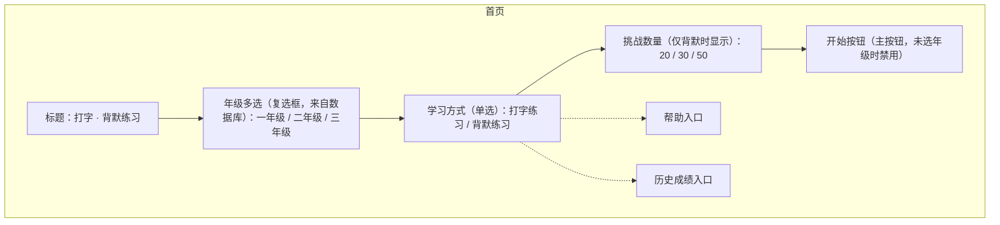
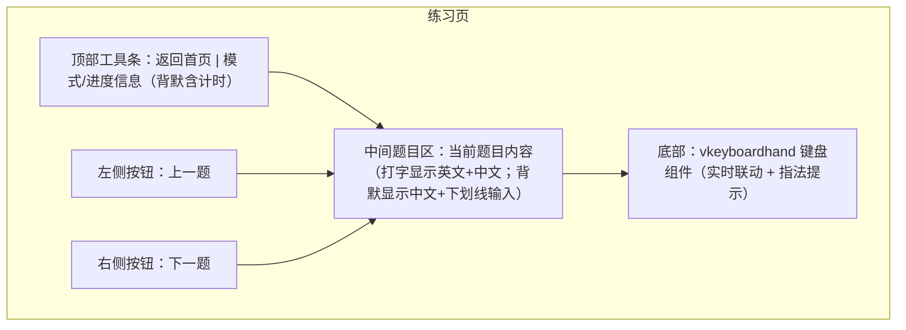

# 打字 + 背默练习小程序 —— 产品需求文档（PRD）

> 创建日期：2026-10-01
> 性质：内部自用学习工具，不记名、无账号、无后端，纯静态部署。

## 1. 需求背景

现有工程 `vkeyboardhand` 是一个交互式指法教学组件（SVG 键盘图 + SVG 手势图 + JavaScript 事件驱动），已具备"高亮键位、手势联动、主题切换、按键回调"等完整组件能力，但目前只有演示页 `index.html`，缺少面向真实学习人群的应用外壳。

我们已整理出《沪教版（上教版）上海小学 1–3 年级英语核心词汇&句型汇总表》，共 325 条（原文 / 翻译 / 年级）。本次改造在此组件之上，构建一个"打字 + 背默"练习应用：打字练习巩固键位与拼写，背默练习检验拼写记忆并评分。全应用离线可用、数据落在本地数据库，无需网络与登录。

## 2. 目标（成功标准）

- 主流程闭环：首页选择年级与模式 → 进入练习 → 完成/提交 → 查看得分 → 记录成绩，全程无后端依赖。
- 题库可维护：325 条内容以初始 sqlite 数据库文件随站点一起发布，年级选项由数据库内容自动生成，不写死在界面里。
- 评分准确：背默模式按"答对题数 / 总题数"或"答对字符数 / 总字符数"计百分比，并记录完成用时。
- 组件复用：练习页复用 `vkeyboardhand` 做实时按键联动与指法提示，不重复实现键盘可视化。
- 数据持久：成绩写入本地 sqlite 并跨会话保留，历史成绩页可回看。

成功校验口径：一次"选年级 → 打字或背默 → 提交 → 查成绩"完整走通即视为核心闭环达成。

## 3. 用户与场景

目标用户：上海地区 1–3 年级小学生及其家长（家长陪伴、学生操练）。

核心场景（按优先级排序）：

1. 打英文字母 / 单词时，边看词边敲键，训练十指指法与拼写熟练度（打字练习）。
2. 阶段复习时，只看中文默写英文，检验是否真正记住拼写（背默练习）。
3. 家长回看历史成绩，了解孩子正确率变化（历史成绩）。

## 4. 功能需求

### 4.1 功能总览表

| # | 模块 | 功能描述 |
|---|------|---------|
| 1 | 首页 | 年级多选（选项来自数据库）、学习方式单选（打字练习 / 背默练习）、背默模式下的挑战数量选择（20 / 30 / 50）、开始按钮、帮助入口、历史成绩入口 |
| 2 | 练习页共用框架 | 顶部返回首页、中间靠上显示当前题目内容、底部渲染 vkeyboardhand 键盘组件、左右两侧切换按钮、键盘方向键切换 |
| 3 | 打字练习模式 | 显示完整英文与中文，逐字符输入校验：正确变绿并前进、错误标红且不前进、全对自动跳下一题 |
| 4 | 背默练习模式 | 只显示中文，英文以"下划线占位"提示字符总数，逐字符输入（含空格与标点），计时，逐题作答、可跳转，提交后评分 |
| 5 | 成绩提交与结果页 | 提交后逐题比对，仅展示做错的题，正确与错误上下对齐；按百分比打分并记录用时 |
| 6 | 成绩记录 | 提交前要求输入用户名（任意文本），连同年级、模式、题量、得分、用时、时间戳写入本地数据库 |
| 7 | 帮助页 | 由现有 `index.html` 改造而来，保留 vkeyboardhand 组件演示与用法说明，作为应用帮助文档 |
| 8 | 历史成绩页 | 按时间倒序列出历史成绩记录，展示用户名、模式、年级、题量、得分、用时、时间 |

### 4.2 模块详情与原型

#### 模块 1：首页

布局自上而下：标题 → 年级多选 → 学习方式 → （条件显示）挑战数量 → 开始按钮 → 两个次级入口（帮助、历史成绩）。

- 业务逻辑：进入首页时，从数据库读取年级去重列表生成勾选项；默认不选中任何年级。学习方式默认选中"打字练习"。
- 交互逻辑：用户勾选一个或多个年级 → 选择学习方式 → 若为背默则选择挑战数量 → 点击"开始"进入练习页。点击"帮助"进入帮助页；点击"历史成绩"进入历史成绩页。
- 规则约束：未选任何年级时"开始"按钮禁用。年级选项只来自数据库去重结果，若数据库为空则显示空态提示。挑战数量单选，默认 20。

#### 模块 2：练习页共用框架

三区布局：顶部工具条、中间题目区、底部键盘组件；左右两侧悬浮切换按钮。

- 业务逻辑：进入练习页后，按首页所选年级从数据库取出符合题序的条目列表；打字模式按数据库原始顺序，背默模式随机抽取指定数量。渲染 vkeyboardhand 组件并开启 `listenKeyboard` 实时联动。
- 交互逻辑：点击左右按钮或按键盘方向键 `←` / `→` 切换上/下一题；首题"上一题"、末题"下一题"隐藏或禁用。键盘组件实时高亮用户敲下的真实键位，并在打字模式下用 `press()` 高亮"下一个待输入的字符"对应键位做指法提示。
- 规则约束：切换题目仅改变当前展示，不触发提交。背默模式的计时在进入页面（或抽题完成）时启动。

#### 模块 3：打字练习模式

- 业务逻辑：题库条目按数据库顺序逐条展示；每条完整显示"英文原文 + 中文翻译"。对英文原文做逐字符输入校验：维护位置指针 `pos`，初始为 0。
- 交互逻辑：每条英文渲染为 N 个字符单元（含空格与标点），初始为灰色，`pos` 处为"当前待输入"高亮。用户敲入一个字符：
  - 若 `ch === target[pos]`：`pos` 处字符标绿，`pos` 加 1；
  - 若不等：`pos` 处字符短暂标红（约 300ms 后恢复待输入态），`pos` 不变，即"不能继续输入下一个"。
  - 当 `pos` 等于字符串长度时，本条自动判定完成，延迟片刻后自动切到下一题。
- 规则约束：只对比键盘产生的可见字符，忽略 Shift、Alt、Ctrl、CapsLock 等修饰键。空格与标点同样参与校验。打字模式不计时、不评分、不写入成绩。

#### 模块 4：背默练习模式

- 业务逻辑：进入前已确定挑战数量（20 / 30 / 50），从年级筛选范围内随机抽取该数量条目（若可选题数不足则全取）。抽取完成后一次性渲染全部题目，并启动计时。每题只显示中文，英文呈现为该原文等长的"下划线占位"（每个下划线对应一个字符位，空格与标点同样占一个下划线位，但不回显其具体字符）。
- 交互逻辑：当前聚焦题的下划线输入区逐字符受控：用户敲入字符时，对应下划线位依次被填充；空格与标点也必须由键盘完整敲入。单题作答过程中，用户可按 `Enter` 锁定并跳至下一题，也可按 `←` / `→` 方向键在题目间切换（左键可回到上一题）；也可用鼠标点击题目导航直接跳转到任意一题。
- 题目导航状态色：导航中的每题用一个可点击标题表示作答状态——未作答为灰色、部分填写为橙色、全部填完为绿色。
- 规则约束：每题的填充位置不得超过原文长度（多余输入忽略）。允许留空。提交在全部题目作答完毕（或至少存在已填写内容）后手动点击"提交"触发，不自动提交。计时在提交时停止。

#### 模块 5：成绩提交与结果页

- 业务逻辑：提交后逐题比对用户输入与英文原文，以"题目级"判定——某题用户输入与原文完全一致（含空格、标点、大小写）才计为该题答对。得分 = 答对题数 / 总题数 × 100，向下取整。停止计时，得到完成用时。
- 交互逻辑：结果页只展示做错的题：每题上下两行对齐——上一行显示正确原文（绿色），下一行显示用户实际输入（红色，错误字符标记），如此上下对齐便于逐字符比对错误。
- 规则约束：全对时结果页显示"全部正确"的通过提示，不显示错题列表。结果页需提供"返回首页"入口。

#### 模块 6：成绩记录

- 业务逻辑：首次提交前，要求用户输入用户名（任意文本，可为空则记为"匿名"）。提交成功后，把一条成绩记录写入本地 sqlite：用户名、年级（多选则拼接）、学习模式、题量、得分、用时、时间戳。
- 交互逻辑：提交按钮点击后弹出用户名输入（若已填过本次可复用），确认后写入数据库并展示结果页。
- 规则约束：无账号、无登录、无权限校验。用户名长度做基础限制（0–30 字符）。

#### 模块 7：帮助页

- 业务逻辑：改造现有 `index.html` 为帮助页，保留其 vkeyboardhand 组件演示与代码用法内容，顶部增加"返回首页"入口。
- 规则约束：帮助页不参与练习业务逻辑，仅作为展示页。

#### 模块 8：历史成绩页

- 业务逻辑：从本地数据库读取成绩记录，按时间倒序列表展示。
- 交互逻辑：每条记录展示用户名、模式、年级、题量、得分（百分比）、用时（秒）、提交时间。支持清空全部记录（带二次确认）。
- 规则约束：无记录时显示空态提示。

## 5. 数据与规则

### 5.1 题库数据

来源文件《沪教版（上教版）上海小学1-3年级英语核心词汇&句型汇总表.md》，表格列为 `原文 / 翻译 / 年级`。入库字段：

| 字段 | 类型 | 约束 | 说明 |
|------|------|------|------|
| id | INTEGER | 主键、自增 | 条目标识 |
| content | TEXT | 非空 | 英文原文（单词或句子） |
| translation | TEXT | 非空 | 中文翻译 |
| grade | TEXT | 非空 | 年级，取值：一年级 / 二年级 / 三年级 |

年级取值通过数据库 `SELECT DISTINCT grade` 获得，驱动首页年级选项。

### 5.2 成绩数据

| 字段 | 类型 | 约束 | 说明 |
|------|------|------|------|
| id | INTEGER | 主键、自增 | 记录标识 |
| username | TEXT | 可空（默认"匿名"） | 用户名 |
| mode | TEXT | 非空 | 学习模式：typing / dictation |
| grades | TEXT | 非空 | 所选年级，多选以逗号拼接 |
| total | INTEGER | 非空 | 题目总数 |
| score | INTEGER | 非空 | 百分比得分（0–100） |
| duration | INTEGER | 非空 | 用时（秒） |
| created_at | TEXT | 非空 | 提交时间戳（ISO 字符串） |

### 5.3 业务规则汇总

- 年级选项：由数据库动态生成，界面不硬编码。
- 背默挑战数量：20 / 30 / 50 三选一，默认 20。
- 背默抽取：随机且不重复；可选题数不足时按实际数量抽取。
- 评分口径：题目级（整题完全一致才计答对），得分 = 答对题数 / 总题数 × 100。
- 打字模式：不计时、不评分、不记成绩。
- 背默模式：进入即计时，提交即停表。

## 6. 边界与异常

- 数据库加载失败：提示"题库加载失败"，提供重试。
- 题库为空：首页年级区显示空态，禁止开始。
- 可选题数少于挑战数量：按实际可选题数抽取，并在练习页提示实际题量。
- 用户名留空：以"匿名"记录，不阻断提交。
- 本地存储不可用或写入失败：仍正常展示结果，但提示"成绩未能保存"。
- 连续键盘输入过快：输入校验按事件顺序处理，多余的输入在题目完成后被忽略。

## 7. 验收标准

1. 首页年级选项与数据库实际年级一致，多选有效，未选年级时"开始"不可点。
2. 打字模式：英文与中文完整显示，逐字符正确变绿、错误标红且不前进，全对自动跳下一题，左右按钮与方向键可切换。
3. 背默模式：仅显示中文与下划线占位（位数等于原文字符数，含空格标点），可逐字符输入、回车锁定、方向键与鼠标跳转，导航颜色随状态变化（灰 / 橙 / 绿）。
4. 背默提交：仅展示做错的题，正确与错误上下对齐，给出百分比得分与用时。
5. 成绩写入本地数据库，历史成绩页能按时间倒序回看；关闭网页后重开，成绩仍存在。
6. 帮助页可由首页入口进入，且展示 vkeyboardhand 组件用法说明。