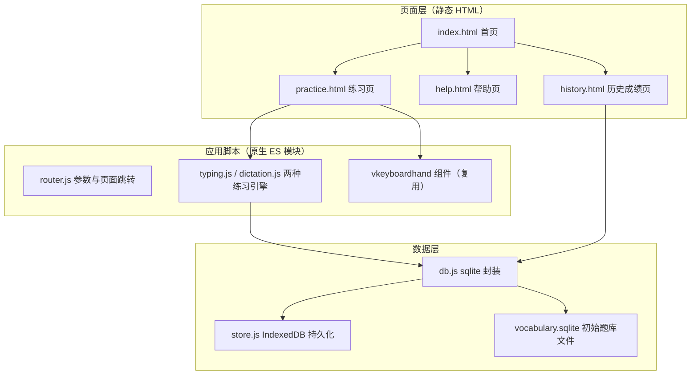
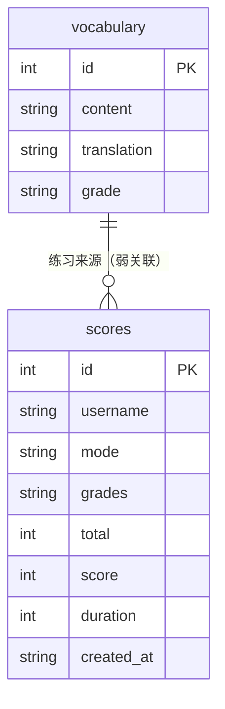
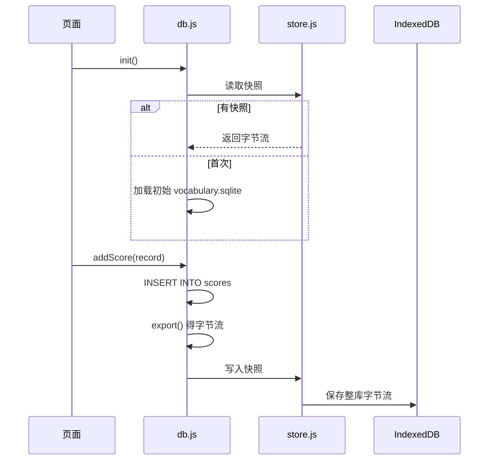
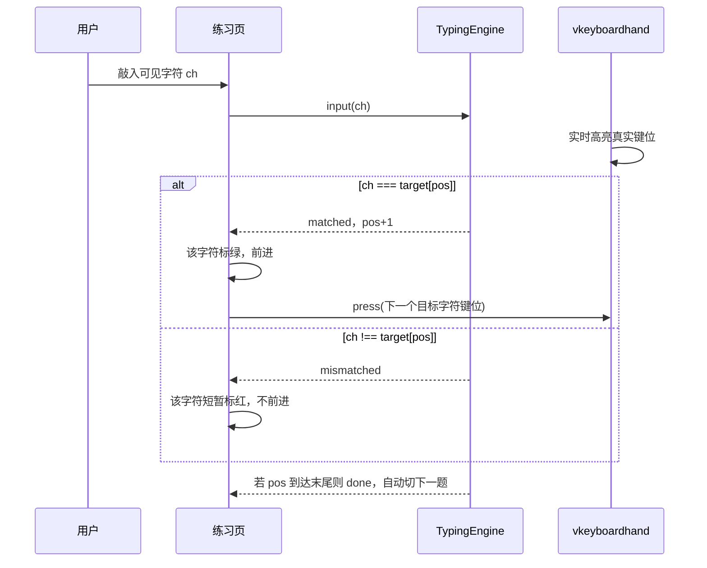
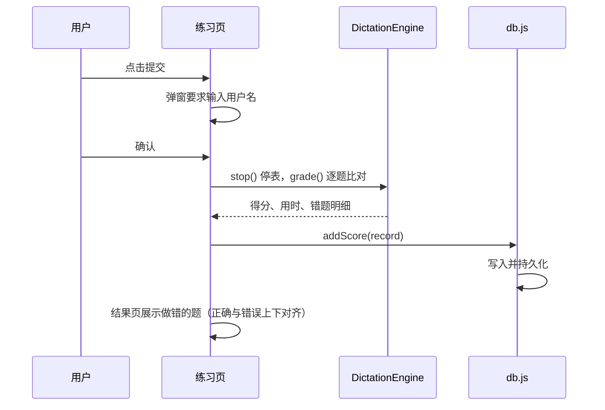

# 打字 + 背默练习小程序 —— 软件设计文档（SDD）

> 创建日期：2026-10-01
> 文档类型：概要设计 + 数据设计（Medium 深度，多模块、含数据库与持久化）

## 1. 设计概述

### 1.1 目标与范围

本次改造在现有 `vkeyboardhand` 组件之上，新增一个面向上海小学 1–3 年级英语的"打字 + 背默"练习应用，包含首页、练习页（打字 / 背默两种模式）、结果页、帮助页、历史成绩页。数据（题库与成绩）全部落在本地 sqlite，无后端、无账号。

明确不在本次范围内：真实后端服务、账号与权限体系、多用户云端同步、移动端（原生 App）、语音与拼读功能。

### 1.2 上游需求追溯

| 设计目标 | 对应 PRD 需求 |
|---------|--------------|
| 首页年级多选动态生成 | PRD 4.2 模块 1、5.3 年级选项 |
| 打字逐字符校验引擎 | PRD 4.2 模块 3 |
| 背默下划线占位 + 计时 + 题目级评分 | PRD 4.2 模块 4、模块 5 |
| 成绩写入本地 sqlite 并跨会话保留 | PRD 模块 6、第 2 章数据持久 |
| 历史成绩回看 | PRD 4.2 模块 8 |
| 复用 vkeyboardhand 键盘组件 | PRD 第 2 章组件复用 |

### 1.3 关键术语

| 术语 | 说明 |
|------|------|
| 题库（vocabulary） | 325 条"原文 / 翻译 / 年级"记录 |
| 打字练习（typing） | 看英文打英文的练习模式 |
| 背默练习（dictation） | 看中文默写英文的练习模式 |
| 位置指针（pos） | 打字模式逐字符校验时，当前待输入字符的下标 |
| 下划线占位 | 背默模式用等长下划线表示原文字符总数的提示方式 |
| sql.js | WebAssembly 版 SQLite，在浏览器内运行 SQLite 数据库 |
| IndexedDB | 浏览器端结构化存储，用于跨会话持久化 sqlite 快照 |

## 2. 系统架构

本项目保持 vkeyboardhand 一贯的"纯 HTML + JS、零框架"风格，采用"多页面 + 共享脚本"的轻量静态架构。四个页面互相跳转，共享统一的数据库模块与组件资源。



架构说明：页面层只负责渲染与收集用户输入；`typing.js` 与 `dictation.js` 承载两种模式的输入校验、计时、评分等纯逻辑，不依赖 DOM，便于单独测试；`db.js` 统一封装 sql.js 的初始化、查询与写入，向上暴露异步接口；`store.js` 负责把修改后的数据库快照写回 IndexedDB，实现跨会话持久。

技术选型与理由：

- 原生 HTML/CSS/JS、多页面，而非引入 Vue/React/构建器：项目现有"零框架、零依赖"定位，练习页逻辑简单，引入框架收益低，[Expert judgment]。
- sql.js（WebAssembly SQLite）做浏览器端数据库：满足"数据存 sqlite"的明确需求，同时无需任何后端即可在静态站点内运行，[Expert judgment]。
- 用构建脚本预生成初始 `vocabulary.sqlite`：把 markdown 题库在构建期固化进数据库文件，运行时无需再做 markdown 解析，[Expert judgment]。
- IndexedDB 保存 `db.export()` 快照实现持久化：sql.js 是内存数据库，退出即失，需把整个库（约十余 KB）导出为字节流写入 IndexedDB，下次启动时反序列化恢复，[Expert judgment]。

## 3. 模块设计

### 3.1 db.js —— 数据库封装

- 责任：初始化 sql.js 数据库、提供题库与成绩的查询与写入、触发持久化。这是唯一直接操作 SQL 的模块。
- 输入：无（内部加载初始 sqlite 文件或 IndexedDB 快照）。
- 输出：`listGrades` / `listItems` / `randomPick` / `addScore` / `listScores` 等异步结果。
- 依赖：sql.js 运行时、store.js（持久化）。
- 边界：不处理任何 UI 逻辑，不理解题目作答。

### 3.2 store.js —— 本地持久化

- 责任：把数据库字节流写入 IndexedDB、启动时读回并判断是否可用。
- 依赖：IndexedDB API。
- 边界：不解析数据库内容，只做字节流存取。

### 3.3 typing.js —— 打字练习引擎

- 责任：维护位置指针、逐字符校验输入、给出"正确 / 待输入 / 错误"状态、判断题目完成。
- 输入：目标字符串、用户按键（可见字符）。
- 输出：当前字符单元状态数组、是否完成事件。
- 依赖：无（纯逻辑）。
- 边界：不负责渲染，不负责键盘组件交互。

### 3.4 dictation.js —— 背默练习引擎

- 责任：随机抽题、维护逐题作答状态（下划线填充）、计时、提交时逐题评分。
- 输入：题干列表、用户逐字符输入、`Enter` / 方向键 / 跳转指令、提交指令。
- 输出：每题作答状态与填充内容、用时、得分与错题明细。
- 依赖：无（纯逻辑）。
- 边界：不负责渲染，不负责数据库写入。

### 3.5 router.js —— 参数与跳转

- 责任：读取 URL 参数 / sessionStorage 中的练习参数（年级、模式、挑战数量），合成页面跳转链接。
- 依赖：无。
- 边界：只做参数传递与跳转，不承载业务判定。

### 3.6 页面脚本

首页、练习页、帮助页、历史页各自一个入口脚本，负责 DOM 渲染、事件绑定，调用上述模块。练习页还需实例化 vkeyboardhand 组件完成键盘可视化。

## 4. 接口设计（模块契约）

以下为各模块对外的函数签名。接口以模块为边界，函数全部为异步或返回同步值，调用方按契约使用。

### 4.1 db.js

| 接口 | 签名 | 说明 |
|------|------|------|
| 初始化 | `init(): Promise<DB>` | 加载初始 sqlite 或 IndexedDB 快照，迁移/建表 |
| 年级列表 | `listGrades(): string[]` | `SELECT DISTINCT grade` 去重结果 |
| 题目列表 | `listItems(grades: string[]): Item[]` | 按年级筛选，按 id 升序返回 |
| 随机抽题 | `randomPick(grades: string[], n: number): Item[]` | 随机不重复抽取 n 条，不足则全取 |
| 记录成绩 | `addScore(record: Score): void` | `INSERT INTO scores(...)` 并调用持久化 |
| 成绩列表 | `listScores(): Score[]` | 按 `created_at` 倒序返回 |
| 持久化 | `persist(): Promise<void>` | `db.export()` 写给 store.js |

其中 `Item = { id: number; content: string; translation: string; grade: string }`，`Score = { id: number; username: string; mode: 'typing' | 'dictation'; grades: string; total: number; score: number; duration: number; created_at: string }`。

### 4.2 typing.js

| 接口 | 签名 | 说明 |
|------|------|------|
| 初始化 | `new TypingEngine(target: string)` | 重置指针与状态 |
| 输入 | `input(ch: string): 'matched' | 'mismatched' | 'ignored' | 'done'` | 处理一个可见字符，返回本次结果 |
| 状态 | `getState(): Cell[]` | 返回每个字符单元的显示状态 |
| 判断完成 | `isDone(): boolean` | 指针是否到达末尾 |

须知：`input()` 忽略修饰键，只在 `ch` 为可见字符时推进；`matched` 表示指针前进，`mismatched` 表示指针不动，`done` 表示本条完成。

### 4.3 dictation.js

| 接口 | 签名 | 说明 |
|------|------|------|
| 初始化 | `new DictationEngine(items: Item[], onDirty?: (index) => void)` | 建立逐题作答状态 |
| 输入 | `inputAt(index: number, ch: string): void` | 向指定题填充一个字符 |
| 锁定/切换 | `commit(index: number): void` | 锁定该题，供 Enter 使用 |
| 状态 | `getNavState(): ('empty' | 'partial' | 'done')[]` | 每题作答状态，供导航配色 |
| 计分 | `grade(): GradedItem[]` | 逐题比对，返回错题明细 |
| 计时 | `start() / stop(): number` | 启动 / 停止计时并返秒数 |

其中 `GradedItem = { item: Item; userInput: string; correct: boolean; diff: Array<{ pos: number; expected: string; actual: string }> }`，`diff` 用于结果页"上下对齐"渲染错字符。

## 5. 数据设计

### 5.1 ER 图



说明：`vocabulary` 与 `scores` 之间没有外键强约束——成绩记录的是"某次练习"的统计结果，而非逐题关联，故用弱关联表达业务来源即可。

### 5.2 建表语句

```sql
CREATE TABLE IF NOT EXISTS vocabulary (
  id          INTEGER PRIMARY KEY AUTOINCREMENT,
  content     TEXT NOT NULL,
  translation TEXT NOT NULL,
  grade       TEXT NOT NULL
);

CREATE TABLE IF NOT EXISTS scores (
  id         INTEGER PRIMARY KEY AUTOINCREMENT,
  username   TEXT NOT NULL DEFAULT '匿名',
  mode       TEXT NOT NULL,
  grades     TEXT NOT NULL,
  total      INTEGER NOT NULL,
  score      INTEGER NOT NULL,
  duration   INTEGER NOT NULL,
  created_at TEXT NOT NULL
);
```

### 5.3 初始数据生成

构建脚本 `scripts/build-vocabulary.mjs`（Node）负责把《沪教版…汇总表.md》解析为 INSERT 语句，用 sql.js 的 Node 运行时生成 `data/vocabulary.sqlite`。表 `scores` 的 schema 在同一脚本内建好、初始为空。构建产物随站点一起部署，[Expert judgment]。

解析规则：读取 markdown 表格，跳过表头与分隔行，每行取 `原文 / 翻译 / 年级` 三列写入；`grade` 保留"一年级 / 二年级 / 三年级"原文。

### 5.4 持久化流程



说明：成绩写入是"改内存 → 整库导出 → 写 IndexedDB"三步。整库体积很小，全量快照持久化简单可靠，不引入增量合并复杂度，[Expert judgment]。持久化失败时结果页照常展示，仅提示"成绩未能保存"（对应 PRD 第 6 章）。

## 6. 关键流程

### 6.1 打字模式逐字符校验



### 6.2 背默提交与评分



## 7. 非功能设计

本地单机工具，无并发与高可用诉求，主要约束如下：

- 性能：题库与成绩总量在数百级，sql.js 全量加载与导出均在毫秒级，无索引与缓存压力，[Expert judgment]。
- 离线可用：初始 sqlite 与 sql.js 运行时均随站点本地化（非 CDN），断网也能完整使用。
- 数据容灾：成绩以整库快照存于 IndexedDB，浏览器清站点数据即丢失，属可接受的本地工具风险（见 PRD 第 6 章）。
- 可维护性：题库更新只需改 markdown 源文件并重新构建生成 sqlite，无需改代码。

## 8. 影响与迁移

| 影响项 | 说明 | 迁移动作 |
|--------|------|---------|
| 现有 `index.html` | 目前是组件演示页 | 其内容迁入 `help.html` 并加"返回首页"入口；`index.html` 重写为首页 |
| 新增页面 | `practice.html` / `help.html` / `history.html` | 新建 |
| 新增目录 | `data/`（sqlite 文件）、`app/`（应用脚本与样式）、`docs/`（本文档） | 新建 |
| 新增依赖 | sql.js | 通过 pnpm 安装，构建时将 wasm 产物本地化到站点 |
| 现有构建脚本 | `scripts/build.mjs` 仅打包组件 | 新增 `scripts/build-vocabulary.mjs` 生成题库 sqlite，并挂入 `build` 流程 |
| 文档 | `README.md` 及各语言 `README_*.md` | 目录结构追加新增文件说明（按 AGENTS.md 约定） |

迁移顺序建议：先改造数据脚本生成 sqlite → 封装 db.js / store.js → 实现 typing / dictation 引擎 → 逐页实现（首页 → 练习 → 结果 → 历史 → 帮助）→ 串联跳转与组件集成 → 更新文档与日志。